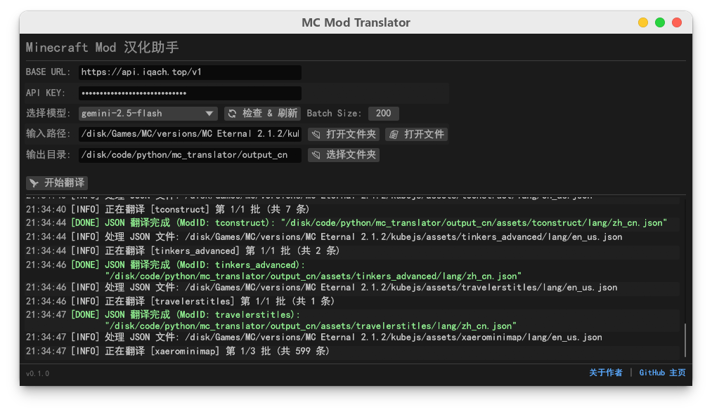

# MC Mod Translator (Minecraft 模组汉化助手)

基于 Rust 与 egui 构建的跨平台图形化 Minecraft 模组翻译工具，通过 AI 大模型实现智能汉化，支持 JAR、JSON、LANG 及 SNBT 多种格式的自动化处理，旨在为玩家与汉化者提供高效、精准的翻译体验。支持全量翻译和增量式翻译。


## 核心功能
- **多格式支持**：支持任务汉化 (SNBT) 和模组汉化 (JAR、JSON、LANG)
- **智能汉化**：通过 AI 大模型实现智能汉化，支持全量翻译和增量式翻译；自动提取翻译文本，最大化节省 token 和钱包。
- **增量更新**：支持"更新翻译/增量式翻译"模式，读取旧汉化文件和内置汉化文件，仅翻译新增的条目，保留原有的人工校对内容。
- **自定义提示词**：支持用户自定义 System Prompt，可针对不同类型的整合包和模组灵活调整翻译风格与术语表。
- **多批次并行**：大文件自动切分，并发请求 API，大幅提升长文本翻译速度。
- **跨平台**：支持 Windows / Linux / macOS
- 支持翻译整个整合包或者单独目录/文件的翻译


## 使用说明
### 1. 任务汉化（流程待完善）
   - 在1.21+，ftbquests 已原生支持语言文件，所以只需翻译对应的语言文件
   - 在1.21-，你有两种方式来完成汉化
  
     a. 使用 https://www.curseforge.com/minecraft/mc-mods/ftb-quest-localizer 或类似工具导出本地化文件，一般会在 `kubejs/assets` 目录下，这种方式强制要求客户端安装相应的汉化

     b. 直接汉化，你需要取消勾选`跳过snbt`, 好处是只需服务端安装汉化，步骤简单，坏处是不可使用增量更新

### 2. 提示词
良好的提示词能够决定汉化的好坏，你可以通过以下方式优化
  - 添加整合包背景、语气等等，本项目会自动提取模组 id，用占位符 `{MODID}` 标识，例如 
  ```
    当前整合包为 RLCraftDregora, 这是一个核污染后的末日世界。当前模组有【冰火之歌、逃逸寄生虫】等
  ```
- 术语翻译：如果你想让 AI 给出更专业和一致性的翻译，可以指定术语表或者让 AI 以某种特定格式的翻译
  + 示例 1：给出一些术语表
  ```
  "Cart":["马车","车","货车","推车","敞篷大车"]
  ```
  + 示例 2：指定格式 `<t s='原文'>译文</t>`、`译文(原文)`，后者可以在保证可读性的情况下且能避免AI胡乱翻译
  ```
  - 如果遇到专业词汇请按照 `<t s='原文'>译文</t>` 格式翻译
  ```
  随后通过正则匹配搜索提取专业词汇，用于优化专有名词的翻译或者结合相应词库进行翻译
- `{SOURCE_LANG}`、`{TARGE_LANG}`用于指示翻译的源语言和目标语言
- 你也可以让ai给你攥写一份提示词
- 注意，最好不要移除 `请严格保留格式代码（如 §a, %s, {{0}}，\\n 等）`、`只返回纯净的 JSON 字符串，不要包含 Markdown 代码块标记` 限制，可能会影响代码解析

## ⚙️ 配置
主要功能可通过GUI配置，可以修改 `MC_Translator/config.json` 来配置当前可用功能。
```json
{
  "api_key": "sk-114514",
  "base_url": "https://api.openai.com/v1",
  "input_path": "/path/to/your/modpack",
  "output_path": "/path/to/your/output",
  "check_path": "", // 暂时不可用的检查路径，可以将output_path指向你的原先汉化文件路径，然后使用增量翻译功能，翻译内容会增加到原先的末尾
  "model": "gemini-3-pro-preview",
  "source_lang": "en_us",
  "target_lang": "zh_cn",
  "batch_size": 100, // 请求的批次大小，由于只翻译键名，可以设置大一点保证上下文的一致性
  "skip_existing": true, // 跳过已存在的文件，主要用于不可增量汉化的任务汉化，其他情况建议使用增量翻译
  "timeout": 600, // 超时时间，遇到 500, 524 错误通常原因是超时时间太短
  "max_retries": 5, // 最大重试次数
  "retry_delay": 10, // 初始重试时间间隔，秒
  "file_semaphore": 5, // 并发文件数，太大可能触发 429 too many request
  "max_network_concurrency": 10, // 最大并发网络请求数
  "prompt": "你是一个《我的世界》(Minecraft) 模组本地化专家。当前模组 ID: 【{MOD_ID}】。\n我将发送一个包含英文原文的 JSON 字符串数组。\n请将数组中的每一项翻译为简体中文，并返回一个 JSON 字符串数组。\n要求：1\n1. **严格保持顺序**：输出数组的第 N 项必须对应输入数组的第 N 项。\n2. **严格保持长度**：输出数组的元素数量必须与输入完全一致。\n3. 请严格保留格式代码（如 §a, %s, {{0}}，\\n 等）。\n4. 只返回纯净的 JSON 字符串，不要包含 Markdown 代码块标记。"
}
```

## 🛠️ 安装与构建

### 预编译版本

请前往 [Releases](https://github.com/chrysoljq/mc_translator/releases) 页面下载适用于 Windows / Linux / macOS 的最新版本。

### 从源码构建
可以通过 fork 本项目自动构建，也可以手动编译本项目：
```bash
# 1. 克隆仓库
git clone https://github.com/chrysoljq/mc_translator.git
cd mc_translator

# 2. 编译发布版本
cargo build --release
```

编译完成后，可执行文件位于 `target/release/` 目录下。

## 📂 支持的目录结构
程序会自动识别输入文件夹中的以下内容：
* `mods/*.jar` (自动解压读取)
* `assets/*/lang/en_us.json`
* `assets/*/lang/en_us.lang`
* `resources/*/lang/en_us.json`
* `kubejs/assets/*/lang/en_us.json`
* `config/ftbquests/**/*.snbt` (任务文件)

## 🤝 贡献
本项目处于初期，欢迎提交 Issue 反馈 Bug 或提交 Pull Request 改进代码。

## 📜 许可证
本项目采用 **GPL-3.0** 许可证
