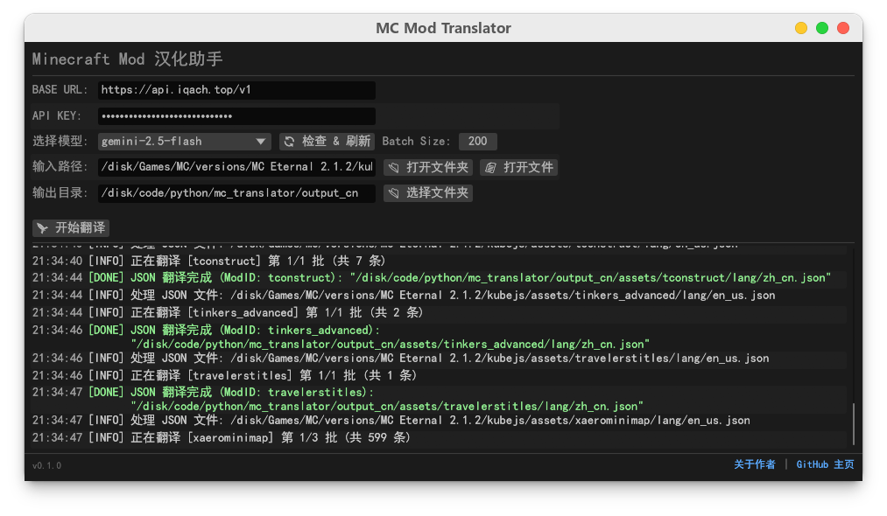

# MC Mod Translator (Minecraft 模组智能汉化助手)

基于 **Rust** 与 **egui** 构建的跨平台图形化 Minecraft 模组翻译工具。利用 AI 大模型（LLM）的强大能力，实现对 JAR、JSON、LANG 及 SNBT 等多格式文件的自动化处理，为玩家与汉化者提供高效、精准的翻译体验。

## ✨ 核心功能

- **全格式支持**：
  - **模组汉化**：直接读取 `.jar` 模组文件、`.json` 不定形语言文件、`.lang` 传统语言文件。
  - **任务汉化**：深度支持 FTB Quests (`.snbt`) 任务文件解析与翻译。
- **AI 智能驱动**：
  - **上下文感知**：基于 AI 理解能力，提供比机翻更通顺的文本。
  - **增量翻译**：智能比对旧版汉化文件，**仅翻译新增条目**，完美保留人工校对的历史成果，最大化节省 Token 消耗。内置 > 社区 > 机翻。
- **高度可定制**：
  - **Prompt 工程**：支持自定义 System Prompt，可针对特定整合包风格注入背景设定。
  - **术语表支持**：通过提示词植入游戏专业术语表，确保专有名词翻译准确一致。
- **高性能架构**：
  - **并发处理**：大文件自动切分，多线程并发请求 API，显著提升长文本翻译速度。
  - **跨平台**：基于 Rust/Egui，原生支持 Windows / Linux / macOS。


## 🚀 使用说明

### 快速开始
1. **选择输入**：选择需要汉化的整合包根目录、`mods` 等目录或单个文件。
   - 程序会自动扫描 `resources`, `mods`, `kubejs`, `assets`, `config/ftbquests` 等关键路径。
2. **配置输出**：
   - 建议选择 **“增量更新/更新翻译”** 模式。
   - 可将输出目录指向现有的 `i18n` 汉化资源包目录（如已解压），程序将自动补全缺失的翻译。
3. **开始翻译**：
   - 翻译完成后会生成标准 `assets` 资源结构，可直接打包为材质包使用。
   - 任务文件会生成对应的 `config` 结构，支持直接覆盖安装。
   - `raw_content` 目录仅用于核对原始内容，通常无需关注。

### 任务脚本汉化指南 (FTB Quests)
针对不同 Minecraft 版本，策略有所不同：

- **Minecraft 1.21+**：
  - FTB Quests 原生支持语言文件。
- **Minecraft 1.21 以下**：
  - **方案 A（推荐 - 兼容性好）**：
    使用 [FTB Quest Localizer](https://www.curseforge.com/minecraft/mc-mods/ftb-quest-localizer) 导出本地化文件（通常位于 `kubejs/assets`），然后对此文件进行翻译。此方案需要客户端加载汉化资源包。
  - **方案 B（简单直接）**：
    直接对 `.snbt` 文件进行硬翻译。优点是服务端部署后客户端无需额外汉化，缺点是难以进行增量更新维护。

### 💡 提示词 (Prompt) 优化技巧
优秀的 Prompt 是高质量翻译的关键，您可以在配置中尝试以下技巧：

1. **注入背景信息**：
   ```text
   当前整合包为 RLCraftDregora，这是一个核污染后的末日废土世界。
   当前模组包含【冰火之歌】、【寄生虫】等高难度模组，翻译风格需压抑、硬核。
   ```
2. **统一术语表**：
   ```text
   请严格遵守以下术语翻译：
   "Cart": ["大车", "板车"] (不要翻译成购物车)
   "Mob": ["生物", "怪物"]
   ```
3. **保留原文对照**（便于校对）：
   ```text
   遇到生僻专有名词，请按 `<t s='原文'>译文</t>` 格式输出，保留原文以便查阅。
   ```

## ⚙️ 配置详解

主要功能可通过 GUI 配置，亦可手动修改 `MC_Translator/config.json`：

```json
{
  "api_key": "sk-xxxxxx",                // LLM API 密钥
  "base_url": "https://api.openai.com/v1", // API 接口地址
  "input_path": "./modpack",              // 输入路径
  "output_path": "./output",              // 输出路径
  "model": "gemini-3-pro-preview",        // 模型名称
  "source_lang": "en_us",                 // 源语言代码
  "target_lang": "zh_cn",                 // 目标语言代码
  "batch_size": 100,                      // 单次请求的条目数，较大值有助于保持上下文一致性
  "skip_existing": true,                  // 跳过已翻译文件（主要针对不可增量的硬翻译模式）
  "timeout": 600,                         // 请求超时时间 (秒)
  "max_retries": 5,                       // 失败重试次数
  "file_semaphore": 5,                    // 文件并发处理限制 (过高可能导致 429 错误)
  "max_network_concurrency": 10,          // 网络请求并发限制
  "prompt": "..."                         // 自定义系统提示词
}
```

## 🛠️ 安装与构建

### 下载预编译版本
前往 [Releases](https://github.com/chrysoljq/mc_translator/releases) 页面下载适用于 Windows / Linux / macOS 的最新版本，解压即用。

### 源码构建
如果您安装了 Rust 环境，可以手动编译：

```bash
git clone https://github.com/chrysoljq/mc_translator.git
cd mc_translator
cargo build --release
```
编译文件位于 `target/release/` 目录。

## 📂 支持的文件类型自动识别
- `mods/*.jar` (自动提取语言文件)
- `assets/*/lang/*.json`
- `assets/*/lang/*.lang`
- `kubejs/assets/*/lang/*.json`
- `config/ftbquests/**/*.snbt` (任务结构文件)

## 🗓️ 待办事项 (TODO)
- [ ] 支持 KubeJS Tooltips 导出或直接汉化
- [ ] 支持 CrT (CraftTweaker) 脚本汉化
- [ ] 支持 Patchouli (帕秋莉) 手册汉化
- [ ] UI 界面美化与交互优化
- [ ] CLI 命令行模式支持
- [ ] 集成社区词典
- [ ] 更多...

## 🤝 贡献
本项目处于早期开发阶段，欢迎提交 Issue 反馈 Bug，或提交 Pull Request 共同改进！

## 📜 许可证
本项目采用 **GPL-3.0** 许可证。
